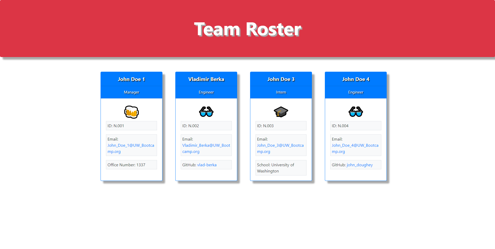

# Team Profile Generator 
## Vladimir Berka's Homework #10

## Assignment Description
This is a HTML/Javascript homework assignment for the UW Bootcamp. The goal of the assignment is to create a console enabled web app that populates team member information based on command line inputs. Unit Testing should also be utilized. The Javascript file is the primary challenge of this assignment. "Inquirer" and "Jest" NPM packages shall be used.

A mockup is provided by the instructor to demonstrate desired application appearance.

The original user story, acceptance criteria, and mockup for the assignment is copied to the end of this document.

## Assignment Scope
Create a command line script that allows a user to enter in team member information and render a final HTML web page. Information and data should be stored in classes before rendering an HTML document.

Information and functionality shall be verified with Unit Testing.

No starting code has been provided.

## Generalized Tasks
- Use NPM "Inquirer" to create command line prompts for user input
- Write a javascript file with multiple functions to handle prompting for user input
- Create classes with proper intheritance and polymorphism to access data
- Use `string literals` to populate an HTML file for the final rendered page
- Use NPM "Jest" to create meaningful unit tests

## List of Files
* README.md - This current read me file
* gitignore - Git Ignore file to ignore node_modules and DS.Store (Mac users)
* index.js - The primary script file to run in the command line
* package.JSON - JSON package that stores modules and settings used
* ~./__test__/ - Javascript test files for the above noted website, tested using "Jest"
* ~./assets/- Folder for stored screenshots and instructor provided demo.gif
* ~./dist/ - A folder for storing the finalized rendered HTML file and web page
* ~./lib/ - A folder for storing the separate class javascript files used

# Original Homework Assignment Details

## User Story

```md
AS A manager
I WANT to generate a webpage that displays my team's basic info
SO THAT I have quick access to their emails and GitHub profiles
```

## Acceptance Criteria

```md
GIVEN a command-line application that accepts user input
WHEN I am prompted for my team members and their information
THEN an HTML file is generated that displays a nicely formatted team roster based on user input
WHEN I click on an email address in the HTML
THEN my default email program opens and populates the TO field of the email with the address
WHEN I click on the GitHub username
THEN that GitHub profile opens in a new tab
WHEN I start the application
THEN I am prompted to enter the team manager’s name, employee ID, email address, and office number
WHEN I enter the team manager’s name, employee ID, email address, and office number
THEN I am presented with a menu with the option to add an engineer or an intern or to finish building my team
WHEN I select the engineer option
THEN I am prompted to enter the engineer’s name, ID, email, and GitHub username, and I am taken back to the menu
WHEN I select the intern option
THEN I am prompted to enter the intern’s name, ID, email, and school, and I am taken back to the menu
WHEN I decide to finish building my team
THEN I exit the application, and the HTML is generated
```

## URL to the GitHub Repository

[GitHub Pages Link:https://github.com/vlad-berka/Team_Profile_Generator](https://github.com/vlad-berka/Team_Profile_Generator)

## Screenshot of the Team Profile Generator, General Appearance



## Instructor Provided Mock-Up

The following instructor provided sreenshot demonstrates the desired application appearance:


## License
MIT License

Copyright (c) [2022] [Vladimir Berka]

Permission is hereby granted, free of charge, to any person obtaining a copy
of this software and associated documentation files (the "Software"), to deal
in the Software without restriction, including without limitation the rights
to use, copy, modify, merge, publish, distribute, sublicense, and/or sell
copies of the Software, and to permit persons to whom the Software is
furnished to do so, subject to the following conditions:

The above copyright notice and this permission notice shall be included in all
copies or substantial portions of the Software.

THE SOFTWARE IS PROVIDED "AS IS", WITHOUT WARRANTY OF ANY KIND, EXPRESS OR
IMPLIED, INCLUDING BUT NOT LIMITED TO THE WARRANTIES OF MERCHANTABILITY,
FITNESS FOR A PARTICULAR PURPOSE AND NONINFRINGEMENT. IN NO EVENT SHALL THE
AUTHORS OR COPYRIGHT HOLDERS BE LIABLE FOR ANY CLAIM, DAMAGES OR OTHER
LIABILITY, WHETHER IN AN ACTION OF CONTRACT, TORT OR OTHERWISE, ARISING FROM,
OUT OF OR IN CONNECTION WITH THE SOFTWARE OR THE USE OR OTHER DEALINGS IN THE
SOFTWARE.